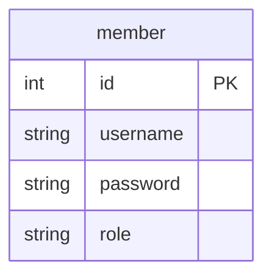
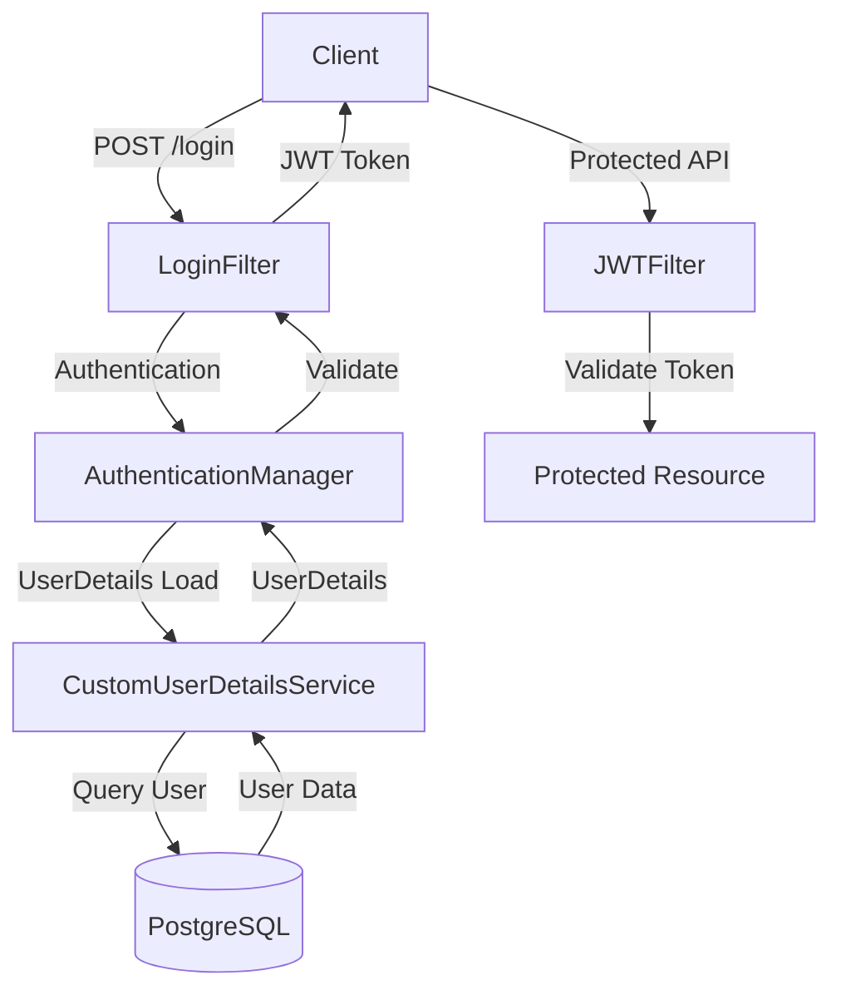

# Spring Security + JWT Login

## Dependencies

- Spring Security
- Spring JPA
- [Mybatis Spring Boot Starter](https://mvnrepository.com/artifact/org.mybatis.spring.boot/mybatis-spring-boot-starter)
- Lombok
- [JJWT (0.12.3)](https://github.com/jwtk/jjwt)
- PostgreSQL

## Database Schema



## Security Flow



## Authentication Flow

1. Client sends login request with username/password (JSON format)
2. LoginFilter processes the authentication request
3. AuthenticationManager delegates to CustomUserDetailsService
4. User information is retrieved from PostgreSQL
5. If authentication is successful, JWT token is generated
6. Subsequent requests use JWT token for authentication

## Implemented Filters

- `LoginFilter`: Handles authentication and JWT token generation
- `JWTFilter`: Validates JWT tokens for protected endpoints

## Configuration

### Database Configuration
```yaml
spring:
  datasource:
    url: jdbc:postgresql://localhost:5432/your_database
    username: your_username
    password: your_password
```

### CORS Configuration
```yaml
cors:
  allowed-origins: your_client_url
```

## TODO

- [ ] Verify CORS configuration with Frontend (Vue.js)
- [ ] Implement token refresh mechanism
- [ ] Implement logout mechanism

## API Endpoints

### Authentication
- POST `/login`: Authentication endpoint (Accept JSON payload)
- POST `/join`: User registration (JSON payload)

### Protected Endpoints
- GET `/hello`: General user endpoint (Requires JWT token)
- GET `/admin`: Admin only endpoint (Requires ROLE_ADMIN)
