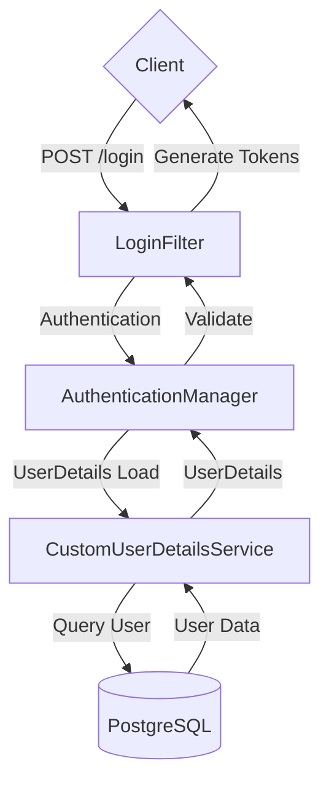
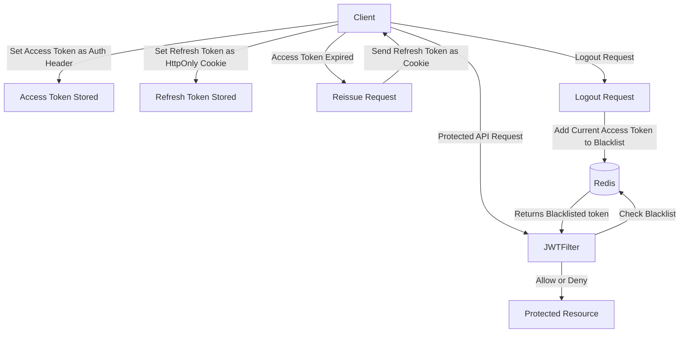

# Spring Security + JWT Login & Logout

## Dependencies

- Spring Security
- Spring JPA
- [Mybatis Spring Boot Starter](https://mvnrepository.com/artifact/org.mybatis.spring.boot/mybatis-spring-boot-starter)
- Lombok
- [JJWT (0.12.3)](https://github.com/jwtk/jjwt)
- PostgreSQL
- Redis

## Database Schema


## Security Flow





## Authentication Flow

1. Client sends a login request with username/password (JSON format).
2. `LoginFilter` processes the authentication request.
3. `AuthenticationManager` delegates to `CustomUserDetailsService`.
4. User information is retrieved from PostgreSQL.
5. If authentication is successful, the system generates:
    - **Access Token** (sent in Authorization Header)
    - **Refresh Token** (saved as HttpOnly Cookie)
6. Subsequent requests include the Access Token in the Authorization Header.
7. `JWTFilter` validates the Access Token for protected endpoints.
8. If the Access Token is expired or client sends reissue request:
    - The client sends a reissue request with the Refresh Token (HttpOnly Cookie).
    - `TokenReissueFilter` validates the Refresh Token using Redis.
    - If the Refresh Token is valid:
        - A new Access Token is issued.
        - A new Refresh Token is issued and stored.
9. If the Refresh Token is invalid or blacklisted:
   - The user is required to log in again.


## Implemented Filters

- `LoginFilter`: Handles authentication and JWT token generation
- `JWTFilter`: Validates JWT tokens for protected endpoints

## Configuration

### Database Configuration
```yaml
spring:
  datasource:
    url: jdbc:postgresql://localhost:5432/your_database
    username: your_username
    password: your_password
```

### CORS Configuration
```yaml
cors:
  allowed-origins: your_client_url
```

### In-memory DB Configuration (Redis)

To use Redis as an in-memory database for token management (e.g., JWT blacklist), set up the following Redis container using docker-compose.yml.
Alternatively, you can use your own locally installed Redis instance.

#### Docker Compose Configuration
```yaml
version: '3.8'

services:
  redis:
    image: redis:latest
    container_name: my_redis
    restart: always
    ports:
      - "6677:6677"
    volumes:
      - redis_data:/data
    command: redis-server --port 6677 --appendonly yes

volumes:
  redis_data:
    driver: local
```

#### Spring Redis Configuration

Ensure your Spring application is configured to connect to Redis on the specified port.

```yml
  # Redis config
spring:
  data:
    redis:
      host: localhost
      port: 6677
```

To check the blacklist directly in Redis, you can use the following command:

```redis
SCAN 0 MATCH blacklist:* COUNT 100
```
This command iterates through keys matching the pattern blacklist:*, retrieving up to 100 keys per iteration. Adjust the COUNT value as needed for performance optimization.

## TODO

- [ ] Verify CORS configuration with Frontend (Vue.js)
- [x] Implement token refresh mechanism
- [x] Implement logout mechanism

## API Endpoints

## API Endpoints

### Authentication
- **POST** `/login`: Authentication endpoint (Accepts JSON payload)
- **POST** `/join`: User registration (JSON payload)
- **POST** `/logout`: Logs out the user (Requires Access Token in Authorization Header)

### Protected Endpoints
- **GET** `/hello`: General user endpoint (Requires JWT Access Token)
- **GET** `/admin`: Admin only endpoint (Requires Access Token with ROLE_ADMIN)

### Token Management
- **POST** `/reissue`: Token rotation (Accepts Refresh Token, Access Token is optional)
